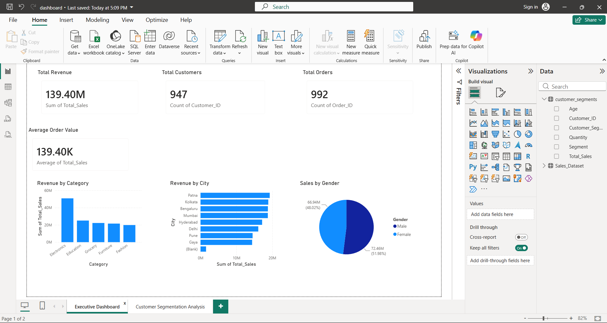
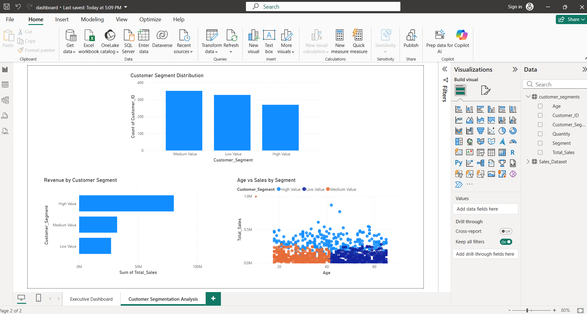
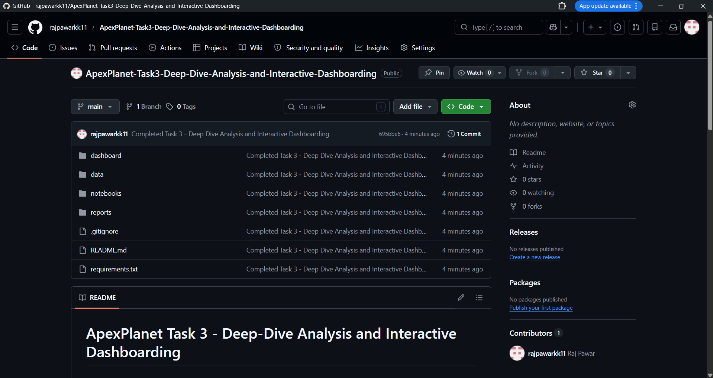

# ApexPlanet Task 3 - Deep-Dive Analysis and Interactive Dashboarding

## Objective

Perform deep-dive business analysis and build an interactive Power BI dashboard.

## Dataset

ApexPlanet_DataAnalytics_Dataset.xlsx

## Tools Used

- Python
- Pandas
- NumPy
- Scikit-Learn
- Matplotlib
- Seaborn
- Power BI

## Analysis Performed

### Core KPIs

- Total Revenue
- Total Orders
- Total Customers
- Average Order Value

### Deep-Dive Analysis

Customer Segmentation Analysis using K-Means Clustering.

### Dashboard

#### Page 1 - Executive Dashboard

- Total Revenue
- Total Orders
- Total Customers
- Average Order Value
- Revenue by Category
- Revenue by City
- Sales by Gender

#### Page 2 - Customer Segmentation Analysis

- Customer Segment Distribution
- Revenue by Customer Segment
- Age vs Sales by Segment

## Project Structure

```text
data/
notebooks/
reports/
dashboard/
images/
```

## Dashboard Screenshots

### Executive Dashboard



### Customer Segmentation Dashboard



### GitHub Repository



## Key Findings

- High Value customers generated the highest revenue.
- Electronics was the top-performing category.
- Patna generated the highest sales among all cities.
- Customer segmentation helped identify High Value, Medium Value, and Low Value customer groups.
- Interactive dashboards improved business insight generation and decision-making.

## Conclusion

This project demonstrates practical skills in:

- Business Analytics
- Customer Segmentation
- Data Visualization
- Power BI Dashboard Development
- Data-Driven Decision Making

## Author

Raj Vijay Pawar